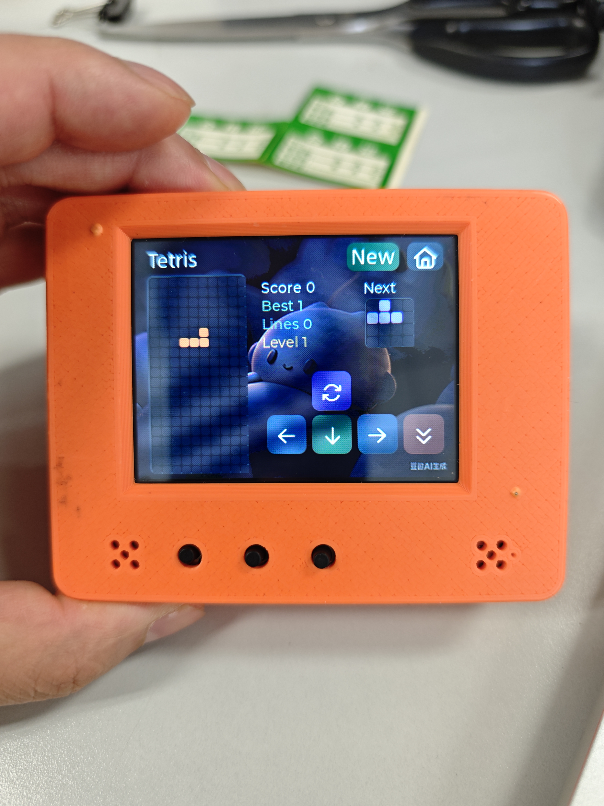
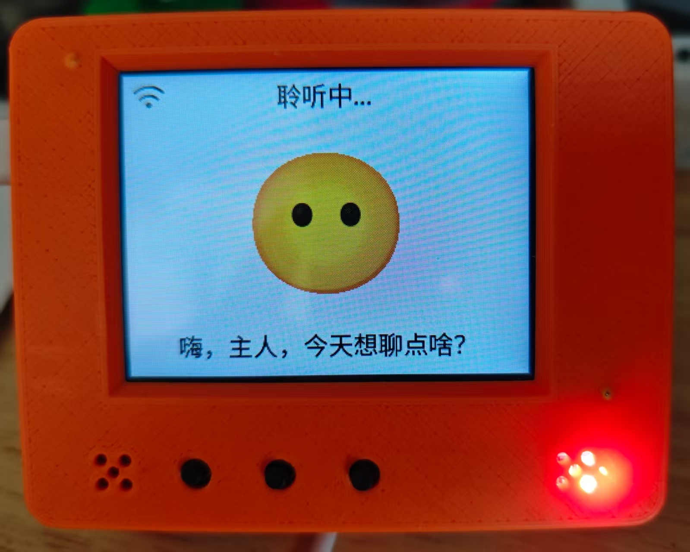
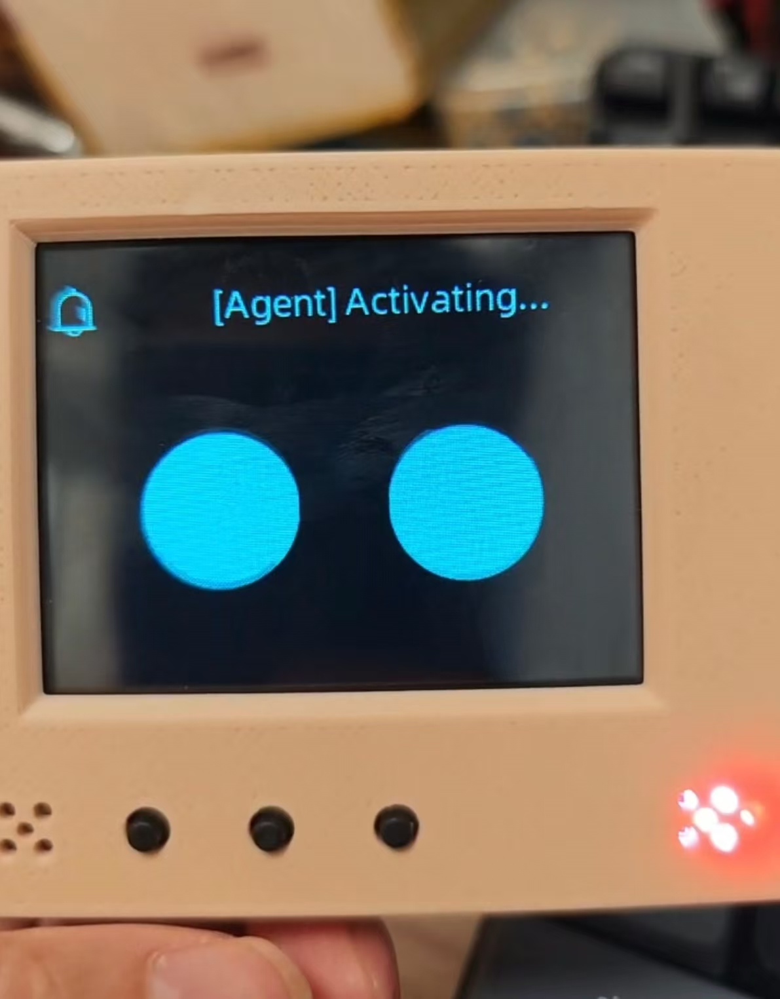
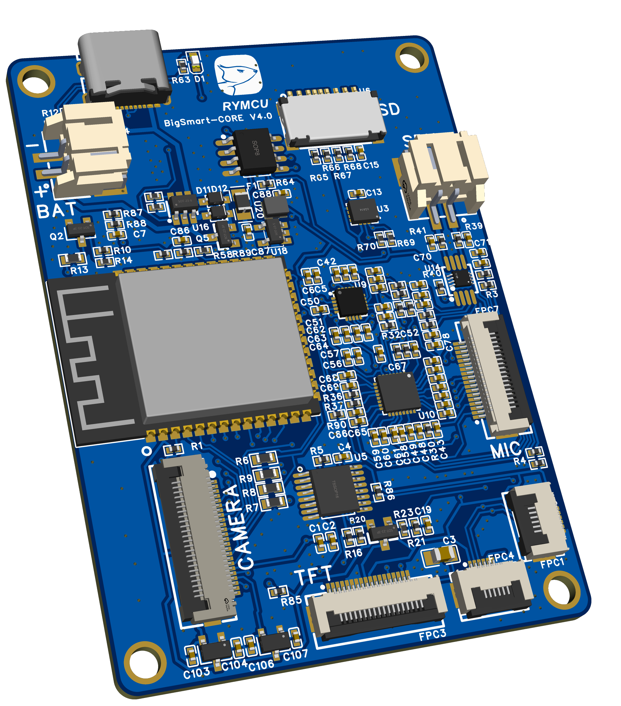
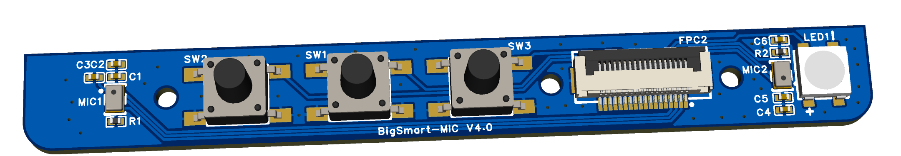

# RYMCU BigSmart AI助手

**中文** | [English](README.en.md)

基于 **ESP32-S3-WROOM-1-N16R8** 的智能语音交互开发板，集成音频系统、显示系统、摄像头、传感器、MicroSD 存储和电池供电等多种外设。

## 主要特性

- **主控**: ESP32-S3-WROOM-1-N16R8 (16 MB Flash + 8 MB PSRAM)
- **音频**: ES8311 DAC + ES7210 四通道 ADC + NS4150B 功放
- **显示**: 2.8" ST7789 LCD (320 x 240) + GT911 电容触摸屏
- **摄像头**: GC0308 (640 x 480 @ 16 FPS)
- **传感器**: QMI8658 六轴加速度计/陀螺仪
- **存储**: MicroSD 卡槽
- **电池**: 2500mAh 3.7V 锂离子电池
- **其他**: WS2812B RGB LED、电池充电管理、按键输入

## 实物展示

| Home | Xiaozhi |
|------|---------|
|  |  |

| Page 1 | Tetris |
|--------|--------|
|  |  |

## 第三方支持

RYMCU BigSmart 已合并到以下官方开源项目，方便用户基于主线生态进行固件开发和应用验证。

| 小智 AI 官方 | 乐鑫科技 Espressif 官方 |
|--------------|--------------------------|
| [78/xiaozhi-esp32](https://github.com/78/xiaozhi-esp32)<br>[PR #1958](https://github.com/78/xiaozhi-esp32/pull/1958) | [espressif/esp-brookesia](https://github.com/espressif/esp-brookesia)<br>[PR #94](https://github.com/espressif/esp-brookesia/pull/94) |
|  |  |

## 硬件 PCB 图

BigSmart 硬件由主板和麦克风按键副板组成。硬件文件夹下提供了完整开源工程文件，只需将对应工程导入立创 EDA 专业版即可使用。

| 主板 | 麦克风按键副板 |
|------|----------------|
|  |  |

## 目录结构

```text
BigSmart-Open/
├── hardware/
│   ├── mainboard/          # 主板 EDA 工程及原理图
│   └── mics-keys/          # 麦克风按键板 EDA 工程及原理图
├── enclosure/              # 外壳 3D 设计文件 (Fusion 360)
├── docs/
│   ├── zh/                 # 中文文档
│   └── en/                 # English documentation
├── firmware/               # 预编译合并固件
├── images/                 # 文档引用图片
├── tools/
│   └── video-converter/    # BigSmart 视频转换器
└── README.md
```

## 文档

| 中文 | English |
|------|---------|
| [快速使用指南](docs/zh/quick-start.md) | [Quick Start Guide](docs/en/quick-start.md) |
| [产品介绍书](docs/zh/product-brief.md) | [Product Brief](docs/en/product-brief.md) |
| [用户详细使用手册](docs/zh/user-manual.md) | [User Manual](docs/en/user-manual.md) |
| [硬件配置说明](docs/zh/hardware.md) | [Hardware Configuration](docs/en/hardware.md) |
| [视频转换器使用说明](docs/zh/video-converter.md) | [Video Converter User Guide](docs/en/video-converter.md) |

## 固件

- [RYMCU 官方固件](firmware/rymcu-V2.3.19-merged.bin)
- [小智 AI 官方固件](firmware/xiaozhi-esp32-merged.bin)
- [乐鑫科技官方固件](firmware/espressif-brookesia-merged.bin)
- [固件烧录说明](firmware/README.md)

## 许可证

- **个人 DIY / 非商业用途**：遵循 [Apache-2.0](LICENSE) 开源许可证。
- **商业用途**：需取得 RYMCU 商用授权，请联系 [RYMCU 官方](mailto:hugh@rymcu.com) 获取授权详情。
