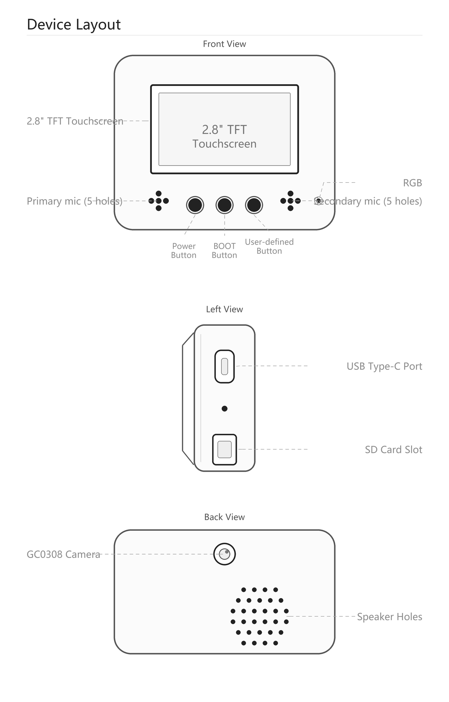

# RYMCU BigSmart Quick Start Guide

[中文](../zh/quick-start.md)

This guide is written for the **RYMCU BigSmart development board** . It covers first boot, Wi-Fi setup, voice interaction, SD card resources, video playback, music playback, and USB disk mode.

For complete build, flashing, and hardware details, see the [User Manual](user-manual.md) and [Hardware Configuration](hardware.md).



## 1. Board Overview

The firmware board type is `rymcu-bigsmart`, and the target chip is `esp32s3`. The reference project enables device-side AEC, the GC0308 camera, and BigSmart-specific peripheral initialization.

| Module | BigSmart configuration |
|--------|------------------------|
| MCU | ESP32-S3-WROOM-1-N16R8 |
| Display | ST7789, 320 x 240, SPI, GT911 touch |
| Audio | ES8311 DAC + ES7210 four-channel ADC + NS4150B amplifier |
| Microphones | MIC1 main, MIC2 secondary, MIC3 AEC reference, MIC4 reserved |
| Camera | GC0308 DVP camera, initialized lazily on first use |
| Storage | MicroSD, SDMMC 1-line mode, mounted at `/sdcard` |
| Sensor | QMI8658 six-axis IMU, attitude and shake detection |
| LED | One WS2812B RGB LED on GPIO43 |
| Buttons | Boot on GPIO0, GPIO10/PTT button |

## 2. Before You Start

Prepare the following items:

| Item | Purpose |
|------|---------|
| RYMCU BigSmart development board | Main device |
| USB Type-C data cable | Power, serial logs, firmware flashing, USB disk mode |
| 5 V USB power supply or computer USB port | Power |
| MicroSD card | Music, video, background images, and game resources |
| 2.4G Wi-Fi | Xiaozhi connection, time sync, internet radio, MQTT |
| Bluetooth HID gamepad | Optional game controller |

Notes:

- Use a USB cable that supports data transfer. Charge-only cables cannot flash firmware or use USB disk mode.
- Format the MicroSD card as FAT32.
- ESP32-S3 supports 2.4G Wi-Fi only.
- On startup, the firmware initializes SD card, display, touch, Wi-Fi manager, buttons, battery monitor, IMU, RGB LED, and MCP tools.

## 3. Firmware Flashing

This repository includes three BigSmart merged firmware images:

```text
firmware/rymcu-V2.3.19-merged.bin
firmware/xiaozhi-esp32-merged.bin
firmware/espressif-brookesia-merged.bin
```

The RYMCU official firmware `rymcu-V2.3.19-merged.bin` is recommended as the default.

Use ESP-IDF, `esptool.py`, or a GUI flashing tool to write it to the ESP32-S3. Command-line example:

```powershell
esptool.py --chip esp32s3 -p COM_PORT -b 460800 write_flash 0x0 firmware\rymcu-V2.3.19-merged.bin
```

For example, if the serial port is `COM8`:

```powershell
esptool.py --chip esp32s3 -p COM8 -b 460800 write_flash 0x0 firmware\rymcu-V2.3.19-merged.bin
```

If automatic download mode fails, hold Boot, reset or power-cycle the board, release Boot, and flash again.

## 4. Power On and First Boot

1. Insert the MicroSD card. It is best to prepare `/music`, `/videos`, and `/background` in advance.
2. Connect the board to a computer or 5 V power supply with USB Type-C.
3. Hold the power button for about 3 seconds.
4. After the screen turns on, the Launcher appears and shows `rymcu-bigsmart` and the firmware version.
5. To view logs, connect to the corresponding COM port with a serial terminal.

Typical startup logs:

```text
RYMCU BigSmart - Starting...
SD card mounted at /sdcard
SD card pins: CLK=47, CMD=48, DAT0=21 (1-line SD mode)
RGB LED strip initialized on GPIO43
WiFi manager initialized early at board startup
```

When the SD card mounts successfully, the firmware checks and creates:

```text
/sdcard/videos
/sdcard/background
```

## 5. Launcher and Apps

The firmware enters the Launcher after startup. According to `E:\RYMCU\xiaozhi\main\application.cc`, common entries include:

| App | Purpose |
|-----|---------|
| Xiaozhi | Start the Xiaozhi voice assistant |
| Settings | Configure Wi-Fi, server, display, and other settings |
| Music | Play MP3 files from the SD card |
| Radio | Play internet radio |
| Video | Play video resources from `/sdcard/videos` |
| Image | View image resources |
| Camera | Use the GC0308 camera |
| Gyro | View QMI8658 attitude/sensor features |
| Games | Enter game-related features |
| USB Disk | Reboot into USB disk mode and share the SD card with a PC |

Use the touch screen to open apps, go back, select files, and adjust settings. The Launcher back button is managed by firmware, so each app may show a different return control.

## 6. Wi-Fi Setup

BigSmart uses the board-level `WifiBoard` and the Settings app for network setup. If no saved Wi-Fi credentials exist, the firmware opens the Settings network page after Launcher initialization.

### 6.1 On-screen Wi-Fi Setup

1. Open `Settings`.
2. Enter the network/Wi-Fi page.
3. Scan nearby Wi-Fi networks.
4. Select a 2.4G Wi-Fi network and enter the password.
5. Save and wait for connection.

### 6.2 Enter Setup with Boot During Startup

When the device is still starting, clicking the Boot button enters the board-level Wi-Fi configuration flow and opens the Settings network page.

### 6.3 Reconfigure During Conversation

BigSmart registers this MCP tool:

```text
self.system.reconfigure_wifi
```

It ends the current conversation and enters Wi-Fi configuration mode. User confirmation is required before calling it.

### 6.4 Hotspot and BLE Provisioning

The Settings app also includes entries to start web hotspot provisioning and BLE provisioning. Actual availability depends on the firmware configuration.

## 7. Xiaozhi Server and Connection Settings

BigSmart firmware reads server settings such as OTA URL, MQTT endpoint, WebSocket URL, client ID, and token from stored settings. Names may differ between firmware versions, but they are usually configured in `Settings`.

Common modes:

| Mode | Description |
|------|-------------|
| Xiaozhi official | Use the official Xiaozhi service |
| RYMCU official | Use the RYMCU service adapted for BigSmart |
| Custom | Enter a self-hosted service, MQTT/WebSocket URL, or token |

After changing server settings, return to the Launcher and reopen Xiaozhi. Reboot the device if needed.

## 8. Button Operations

Button behavior comes from `rymcu_bigsmart_board.cc`:

| Operation | Behavior |
|-----------|----------|
| Hold power for about 3 seconds | Power on/off, depending on the power circuit |
| Click Boot | During startup, enter Wi-Fi setup; during runtime, toggle Xiaozhi conversation state |
| Double-click Boot | Toggle device-side AEC while idle, when `CONFIG_USE_DEVICE_AEC` is enabled |
| Press GPIO10/PTT | Start voice listening when idle or listening |
| Release GPIO10/PTT | Stop voice listening when listening |
| Hold GPIO10 during startup | Enter USB disk mode |

GPIO10 is the PTT button during normal runtime and is also checked during startup for USB disk mode.

## 9. Voice Assistant Quick Use

1. Make sure the device is connected to Wi-Fi.
2. Open `Xiaozhi` from the Launcher.
3. Click Boot to toggle conversation state, or hold GPIO10/PTT to speak.
4. Release GPIO10/PTT when done, or wait for the device to stop listening.
5. The response plays through the speaker and the screen updates with state information.

If the device frequently recognizes its own speaker output, double-click Boot while idle to toggle device-side AEC.

## 10. SD Card Layout

BigSmart mounts the SD card at `/sdcard` using SDMMC 1-line mode:

| Signal | GPIO |
|--------|------|
| CLK | GPIO47 |
| CMD | GPIO48 |
| DAT0 | GPIO21 |

Recommended layout:

```text
/sdcard
├── music/          # MP3 music, subdirectories allowed
├── videos/         # .mjpg/.mp3/.fps video resources
├── background/     # Background images
```

The firmware automatically creates `/sdcard/videos` and `/sdcard/background` on startup. Create `music` manually if needed.

## 11. Music Playback

The `Music` app and MCP tools can play MP3 files from the SD card.

Common MCP tools:

| Function | Tool |
|----------|------|
| Play a specific MP3 | `self.media.play_mp3` |
| Stop playback | `self.media.stop_mp3` |
| List MP3 files | `self.media.list_mp3_files` |
| Get playback state | `self.media.get_mp3_state` |
| Next track | `self.media.play_next` |
| Previous track | `self.media.play_previous` |

Example directory:

```text
/sdcard/music/song1.mp3
/sdcard/music/song2.mp3
```

Example call:

```json
{
  "tool": "self.media.play_mp3",
  "arguments": {
    "filepath": "/sdcard/music/song1.mp3"
  }
}
```

## 12. Video Playback

The `Video` app reads this fixed directory:

```text
/sdcard/videos
```

Each video should use three files with the same base name:

```text
/sdcard/videos/demo.mjpg
/sdcard/videos/demo.mp3
/sdcard/videos/demo.fps
```

| File | Purpose |
|------|---------|
| `.mjpg` | 320 x 240 MJPEG video stream |
| `.mp3` | Matching audio track |
| `.fps` | Frame-rate sidecar for audio/video sync |

If `.fps` is missing, the Video app falls back to 8 fps. Use the repository [Video Converter](video-converter.md) to generate the three files.

Recommended settings:

- Resolution: 320 x 240.
- Frame rate: 8-12 fps.
- JPEG quality: 8.
- MP3: 44100 Hz.

Flow:

1. Convert the video on your computer with `tools/video-converter/RYMCU-Video-Converter.exe`.
2. Copy the generated `.mjpg`, `.mp3`, and `.fps` files to `/videos` on the SD card.
3. Boot the device and enter the Launcher.
4. Open the `Video` app.
5. Tap a video item to play it.

## 13. USB Disk Mode

USB disk mode shares the SD card with a PC as a USB storage device. It is useful for copying music, videos, background images, and other resources.

Enter USB disk mode:

1. Power off or restart the device.
2. Hold GPIO10/PTT.
3. Power on or reset.
4. Release the button after the USB Disk Mode screen appears.
5. Connect the USB data cable to the PC. The SD card appears as a USB drive.

Exit:

- Safely eject the drive on the PC first.
- Tap `Return to Launcher` on the device, or hold GPIO10 for about 1.5 seconds as prompted.

Note: USB disk mode requires a mounted SD card.

## 14. RGB, IMU, MQTT, and Camera

BigSmart firmware also registers local features and MCP tools.

### 14.1 RGB LED

```json
{
  "tool": "self.light.set_rgb_color",
  "arguments": {
    "red": 255,
    "green": 100,
    "blue": 50
  }
}
```

Turn off:

```json
{
  "tool": "self.light.turn_off",
  "arguments": {}
}
```

### 14.2 IMU Attitude and Shake

The QMI8658 initializes after firmware startup and supports attitude reading and shake detection. Typical uses include motion control, state triggers, and interactive demos.

### 14.3 Smart Home MQTT

The firmware includes a SmartHome MQTT client and tools for broker configuration, connect, publish, subscribe, light subscriptions, and humidifier examples.

```text
self.mqtt.configure
self.mqtt.connect
self.mqtt.disconnect
self.mqtt.get_status
self.mqtt.publish
self.mqtt.subscribe
self.mqtt.subscribe_light
self.mqtt.humidifier
```

### 14.4 Camera

The GC0308 camera is lazily initialized. It is not initialized at boot; it is initialized the first time the Camera app or a camera request needs it. This reduces memory pressure during startup.

## 15. Troubleshooting

| Problem | Suggestion |
|---------|------------|
| Screen does not turn on | Hold the power button for about 3 seconds; check USB power and cable |
| No serial port on PC | Use a data-capable USB cable and check drivers/device manager |
| Wi-Fi not found | Use 2.4G Wi-Fi and retry near the router |
| Cannot enter Wi-Fi setup | Click Boot during startup or open the network page from Settings |
| SD card mount fails | Use FAT32, reinsert the card, or try another card |
| Video app shows no files | Put files under `/sdcard/videos`; at least a `.mjpg` file is required |
| Video has no sound | Make sure a same-name `.mp3` file exists |
| Video speed is wrong | Make sure the same-name `.fps` file contains an integer frame rate |
| MP3 playback fails | Use an absolute `/sdcard/...` path and confirm the `.mp3` extension |
| USB disk mode does not enter | Hold GPIO10 before startup/reset and make sure an SD card is inserted |
| Voice recognition has echo | Double-click Boot while idle to toggle device-side AEC |

## 16. Next Reading

- [Product Brief](product-brief.md)
- [User Manual](user-manual.md)
- [Hardware Configuration](hardware.md)
- [Video Converter User Guide](video-converter.md)
