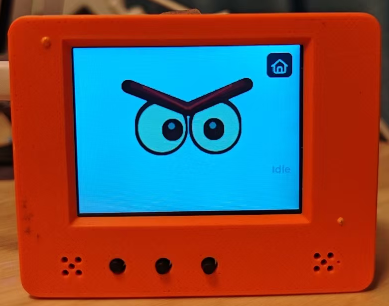
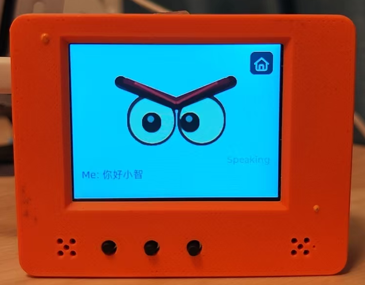

# RYMCU BigSmart Quick Start Guide

[中文](../zh/quick-start.md)

This guide is written for the **RYMCU BigSmart AI assistant**. It helps users complete first boot, network setup, voice interaction, `SD` card resource preparation, music playback, video playback, and `USB` disk mode.

For complete build, flashing, and hardware details, see the [User Manual](user-manual.md) and [Hardware Configuration](hardware.md).

## 1. Firmware and Flashing

`BigSmart` ships with the `RYMCU` official firmware preinstalled and can be used directly after power-on. To upgrade or switch firmware, see the [firmware flashing guide](../../firmware/README.en.md).

The firmware images in this repository are merged images. When using a flashing tool, write the image to `Flash` offset `0x0`.

## 2. Power On and Home Screen

### 2.1 Power On

1. Hold the power button for about `3` seconds to power on. When powered on, hold it again to power off.
2. If the battery is low, connect the board to a computer or `5V` power supply with a `USB Type-C` data cable.
3. After the screen turns on, the `Home` screen appears and shows `rymcu-bigsmart` and the current firmware version.
4. To view logs, connect to the corresponding `COM` port with a serial terminal.

### 2.2 Home Screen and Apps

Swipe left or right on the `Home` screen to switch app pages. Common apps include:

| App | Purpose |
|-----|---------|
| Xiaozhi | Start the Xiaozhi voice assistant |
| Settings | Configure Wi-Fi, server, display, and other settings |
| Music | Play MP3 files from the SD card |
| Radio | Play internet radio |
| Video | Play video resources from `/sdcard/videos` |
| Image | View image resources |
| Camera | Use the GC0308 camera |
| Gyro | View QMI8658 attitude and sensor information |
| Games | Enter game-related features |
| USB Disk | Reboot into USB disk mode and share the SD card with a PC |

Use the touch screen to open apps, go back, select files, and adjust settings.

## 3. Wi-Fi Setup

`Wi-Fi` must be configured before first use. `BigSmart` supports three provisioning methods: on-screen setup, hotspot web setup, and WeChat mini program BLE setup. Choose any one of them.

Open the `Settings` app and enter the `Wi-Fi` settings page.

**Note: BigSmart supports 2.4 GHz Wi-Fi only.**

### 3.1 On-screen Wi-Fi Setup

Tap `Screen WiFi`, enter the `Wi-Fi` SSID and password, and tap `Connect`.

### 3.2 Hotspot Web Setup

Tap `Web Setup` to open hotspot provisioning. Connect your phone to the hotspot shown on the screen, such as `Xiaozhi-11F0`. The phone usually opens the setup page automatically; if not, open the browser page shown by the device and enter the `Wi-Fi` information manually.

### 3.3 WeChat Mini Program BLE Setup

Tap `BLE Setup` to open BLE provisioning. Scan the QR code on the device with WeChat, or search for the mini program `艾塔达克`. Register or sign in before provisioning if prompted.

Mini program flow:

| Open the mini program | Select BLE setup | Complete Wi-Fi setup |
|-----------------------|------------------|----------------------|
|  |  |  |

## 4. Service Provider and Device Binding

### 4.1 Service Provider Settings

Before using the `xiaozhi` voice assistant, set the server address first. The screen configuration supports three service provider options. Open the `Settings` app and tap `Advanced`, as shown below.

Here, `atdak` is the `RYMCU` official server, `tenclass` is the Xiage Xiaozhi AI official server, and `custom` is a custom server where you can enter your own server address.

**The factory default uses the RYMCU official server.**

### 4.2 Device Binding

For first-time use, after entering the `Xiaozhi app`, the device screen shows an activation code or binding code. Enter that code in the corresponding mini program or web console and confirm the binding.

**Choose any one of the following three methods. Make sure it matches the configured service provider. The factory default is the first one.**

#### 4.2.1 RYMCU Official Server Verification-Code Binding

Log in to the WeChat mini program "艾塔达克" and bind the device as shown below.

| Device list entry | Enter binding information |
|-------------------|---------------------------|
|  |  |

#### 4.2.2 tenclass Xiaozhi AI Official Server Verification-Code Binding

Log in to the official console at https://xiaozhi.me/console/agents, click "Device Management", then click "Add Device". Enter the 6-digit verification code spoken by the device or shown on the screen in the add-device dialog.

#### 4.2.3 Custom Server Verification-Code Binding

Bind the device according to your custom server.

In addition, the `RYMCU` official server is open source and can be self-deployed if you have the required technical foundation. Server link: https://github.com/ruanrongman/IntelliConnect

## 5. AI Assistant Usage

**After `wifi` and server configuration are complete, tap the `xiaozhi app` on the screen to enter the AI assistant. After initialization finishes and the `idle` page appears, wake it by saying "Ni hao, Xiaozhi", or press the middle `boot` button to wake it.**

| Idle page | Wakeup page |
|-----------|-------------|
|  |  |

## 6. Music and Video Playback

Tap the `Music app` and `Video app` on the screen to play `mp3` music and videos from the `SD` card.

| Music playback | Video playback |
|----------------|----------------|
|  |  |

**Copy `mp3` music and video files to the `music` and `videos` folders on the `SD` card in advance. See the next section for the operation method.**

## 7. USB Disk Mode

`USB` disk mode shares the `SD` card with a computer as a `USB` drive. It is useful for quickly copying music, videos, background images, and other resources.

Enter USB disk mode:

Tap the `USB Disk app` on the screen to enter `USB`-to-drive mode. Connect the device to a computer with a `USB` cable, and the computer will show the `SD` card as a `USB` drive.

**Copy `MP3` files to the `music` folder.**

**Regular video files need to be converted to a format suitable for playback on the `bigsmart AI` assistant, then placed in the `videos` directory. Use the repository [Video Converter](video-converter.md) for conversion.**

## 8. Internet Radio

Tap the `Radio app` to play internet radio stations.

## 9. Games

Tap the `Games app` to play multiple games.

| Game list | Maze game |
|-----------|-----------|
|  |  |

## 10. Extended Features

`BigSmart` firmware also registers local features and `MCP` tools:

| Feature | Description |
|---------|-------------|
| RGB LED | Set RGB colors and turn the light off |
| IMU attitude and shake | QMI8658 reads attitude data and supports shake detection |
| Smart home MQTT | Configure broker, connect, publish, subscribe, and control example devices |
| Camera | GC0308 is lazily initialized when opening Camera or requesting camera capability for the first time |

## 11. Troubleshooting

| Problem | Suggestion |
|---------|------------|
| Screen does not turn on | Hold the power button for about 3 seconds; check battery level, USB power, and cable |
| No serial port on PC | Use a data-capable USB cable and check drivers/device manager |
| Wi-Fi not found | Use 2.4 GHz Wi-Fi and retry near the router |
| Cannot enter Wi-Fi setup | Open the Wi-Fi page from `Settings`, or reboot and restart the provisioning flow |
| SD card mount fails | Use FAT32, reinsert the card, or try another card |
| Video app shows no files | Put files under `/sdcard/videos`; at least a `.mjpg` file is required |
| Video has no sound | Make sure a same-name `.mp3` file exists |
| Video speed is wrong | Make sure the same-name `.fps` file contains an integer frame rate |
| MP3 playback fails | Use an absolute `/sdcard/...` path and confirm the `.mp3` extension |
| USB disk mode does not enter | Hold GPIO10 before startup/reset and make sure an SD card is inserted |
| Voice recognition has echo | Double-click Boot while idle to toggle device-side AEC |

## 12. Next Reading

- [Product Brief](product-brief.md)
- [User Manual](user-manual.md)
- [Hardware Configuration](hardware.md)
- [Video Converter User Guide](video-converter.md)
