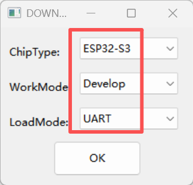
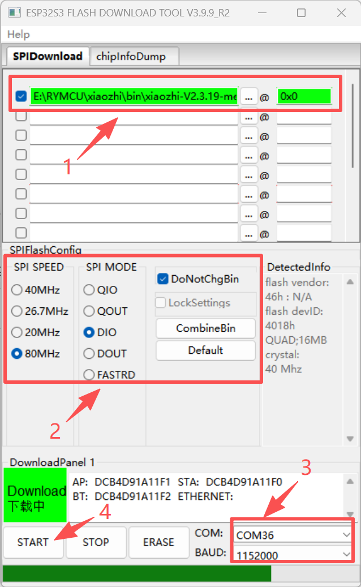
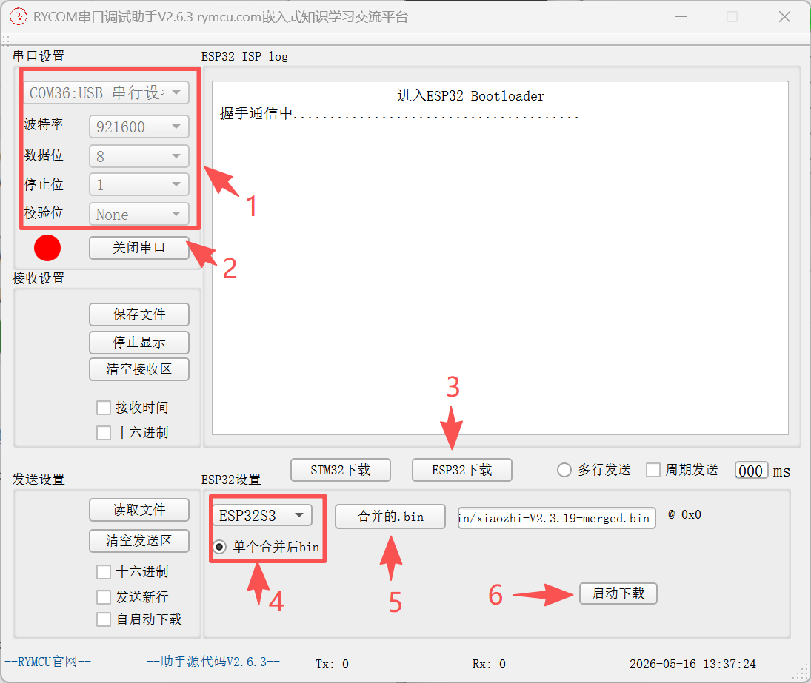
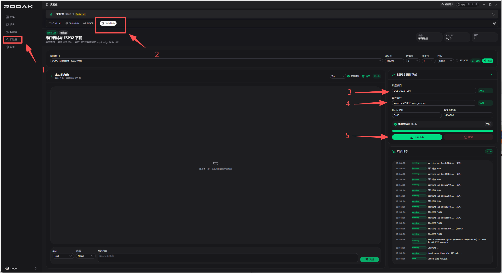
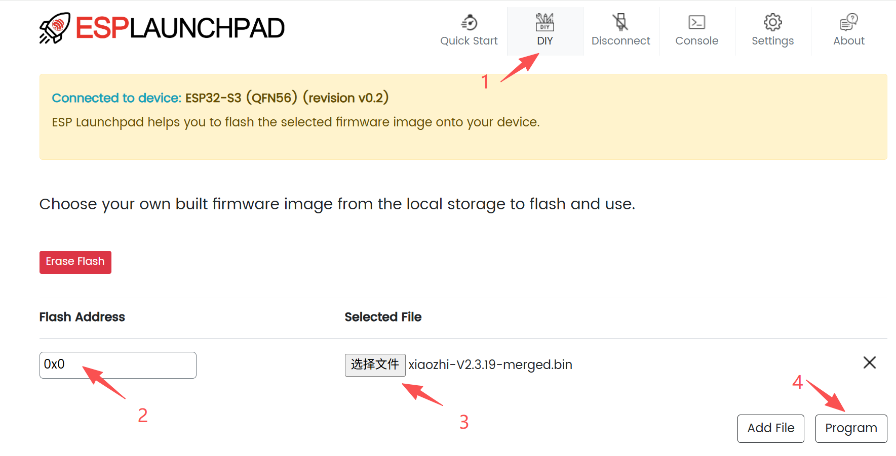

# RYMCU BigSmart 固件烧录说明

**中文** | [English](README.en.md)

本目录存放 RYMCU BigSmart AI 助手可直接烧录的预编译合并固件。固件按来源分为 RYMCU 官方、小智 AI 官方和乐鑫科技官方三个版本。

## 固件文件

| 文件 | 来源 | 说明 |
|------|------|------|
| `rymcu-V2.3.19-merged.bin` | RYMCU 官方 | RYMCU 针对 BigSmart 整理发布的推荐合并固件 |
| `xiaozhi-esp32-merged.bin` | 小智 AI 官方 | 对应 [78/xiaozhi-esp32](https://github.com/78/xiaozhi-esp32) 主线生态的合并固件 |
| `espressif-brookesia-merged.bin` | 乐鑫科技官方 | 对应 [espressif/esp-brookesia](https://github.com/espressif/esp-brookesia) 主线生态的合并固件 |

## 烧录前准备

准备以下物品：

- RYMCU BigSmart AI 助手。
- 可传输数据的 USB Type-C 数据线。
- Windows 电脑和任一支持 ESP32-S3 的烧录工具。

烧录前需要先让设备进入下载模式：

1. 按住 BigSmart 的 Boot 按键不放。
2. 长按电源按键开机。
3. 设备进入下载模式后松开全部按键。
4. 在设备管理器中查看串口号，例如 `COM8`。

后续所有烧录方式都需要先完成以上步骤。烧录完成后，重新开机即可运行新固件。

## 离线烧录方式

以下三种离线烧录工具任选其一即可。所有合并固件都需要写入 Flash 偏移地址 `0x0`。

### 乐鑫 Flash Download Tool

Flash Download Tool 是乐鑫官方离线烧录工具，适合使用图形界面手动选择固件并写入设备。

工具下载链接：[Flash Download Tool](https://docs.espressif.com/projects/esp-test-tools/en/latest/esp32/production_stage/tools/flash_download_tool.html)

下载并解压后，找到 `.exe` 文件双击运行，按界面提示选择芯片、串口、烧录地址和固件文件。

### RYMCU 串口调试助手

RYMCU 串口调试助手提供图形化串口烧录入口，适合快速选择合并固件并写入 BigSmart。

工具下载链接：[RYCOM 2.6.3](https://github.com/rymcu/RYCOM/releases/tag/2.6.3)

安装并打开软件后，选择 BigSmart 对应串口，按图示选择固件文件并开始烧录。

### RYMCU RODAK 工具

RODAK 是 RYMCU 提供的固件下载工具，也可用于烧录 BigSmart 合并固件。

工具下载链接：[RODAK Releases](https://github.com/rymcu/rodak-releases)

安装并打开软件后，选择 BigSmart 对应串口，按图示选择固件文件并开始烧录。

## 在线烧录方式

### 乐鑫 ESP Launchpad

ESP Launchpad 是乐鑫官方网页烧录工具，可直接在浏览器中连接串口并写入固件。

在线烧录链接：[ESP Launchpad](https://espressif.github.io/esp-launchpad/?flashConfigURL=https://espressif.github.io/esp-brookesia/agent/chatbot/launchpad.toml)

操作步骤：

1. 打开网页后点击 `Connect`。
2. 在浏览器弹出的串口列表中选择 BigSmart 对应串口并连接。
3. 点击 `DIY`。
4. 将烧录地址设置为 `0x0`。
5. 选择需要烧录的合并固件。
6. 点击 `Program` 开始烧录。

## 烧录后检查

烧录完成后设备会自动重启。正常情况下可以看到：

- 屏幕亮起并进入 Launcher。
- 主界面显示 `rymcu-bigsmart` 和固件版本。
- 串口日志打印 `RYMCU BigSmart - Starting...`。
- 若已插入 SD 卡，日志显示 `SD card mounted at /sdcard`。

## 常见问题

| 问题 | 处理方法 |
|------|----------|
| 找不到串口 | 更换可传输数据的 USB 线，检查驱动和设备管理器 |
| 烧录失败 | 重新进入下载模式，关闭占用串口的串口终端后重试 |
| 烧录后无显示 | 确认固件写入地址为 `0x0`，重新上电，检查供电 |
| Wi-Fi 无法连接 | 使用 2.4G Wi-Fi，在 Settings 中重新配网 |
